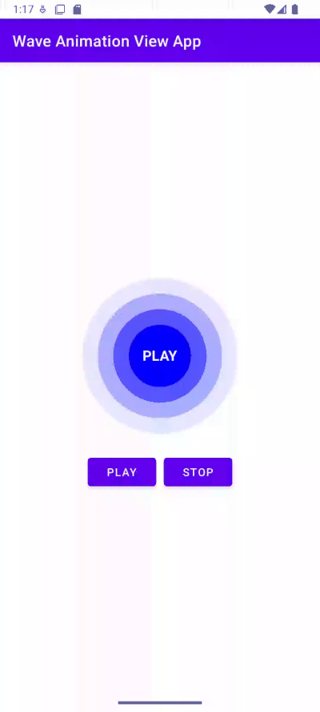

# 🌊 WaveAnimationView


A simple, elegant, and customizable **Wave Animation View** for Android. This view renders animated waveforms that can be used for decorative UI components, music visualizations, splash screens, loading animations, or any creative fluid effects in your app.

---

## 📸 Preview




---

## ✨ Features

- 🌀 Smooth wave animation using native `Canvas` drawing
- 🎨 Customizable properties: wave color, amplitude, frequency, speed
- ⚙️ Easy-to-use XML or programmatic API
- 📱 Supports API 21+ (Android 5.0+)
- 💡 Lightweight and dependency-free

---

## 🛠️ Installation

### Step 1: Add JitPack to your root `settings.gradle` (for Gradle 7.0+)

```groovy
dependencyResolutionManagement {
    repositoriesMode.set(RepositoriesMode.FAIL_ON_PROJECT_REPOS)
    repositories {
        google()
        mavenCentral()
        maven { url 'https://jitpack.io' }
    }
}
```

### Step 2: Add the library to your app-level `build.gradle`

```groovy
dependencies {
    implementation 'com.github.mouhsineAf:waveanimationview:1.0.0'
}
```

---

## 🧩 Usage

### XML Integration

```xml
<com.devm22.waveanimationview.WaveAnimationView
    android:id="@+id/waveView"
    android:layout_width="match_parent"
    android:layout_height="200dp"
    android:layout_marginTop="20dp"
    app:mainWaveColor="#3F51B5"
    app:waveCount="3"
    app:animationSpeed="2"
    app:centerText="Loading"
    app:centerTextColor="#FFFFFF"
    app:centerTextSize="18sp"
    app:textAllCaps="true"
    app:centerImage="@drawable/ic_wave_center"
    app:centerImagePadding="8dp"
    app:centerImageTint="#FF4081"
    app:textStyle="bold" />

```

---

### Java Usage

```java
WaveAnimationView waveView = findViewById(R.id.waveView);

// Set color programmatically
waveView.setMainWaveColor(Color.parseColor("#FF4081"));

// Customize wave appearance and speed
waveView.setWaveCount(4);         // Number of waveforms
waveView.setAnimationSpeed(3);    // Wave animation speed

// Optional: Set center text or image dynamically
waveView.setCenterText("Syncing");
waveView.setCenterTextColor(Color.WHITE);
waveView.setCenterTextSize(20);   // in sp

```

---

### Kotlin Usage

```kotlin
val waveView = findViewById<WaveAnimationView>(R.id.waveView)

waveView.setMainWaveColor(Color.parseColor("#FF4081"))
waveView.setWaveCount(4)
waveView.setAnimationSpeed(3)

waveView.setCenterText("Syncing")
waveView.setCenterTextColor(Color.WHITE)
waveView.setCenterTextSize(20) // in sp

```

---

## ℹ️ Usage Notes

- Default wave color is `#2196F3`
- Use higher amplitude for more dramatic wave heights
- Lower frequency = longer waves, higher frequency = more waves
- Avoid extreme values to maintain performance

---

## 📄 License

This project is licensed under the MIT License. See the [LICENSE](./LICENSE.txt) file for details.